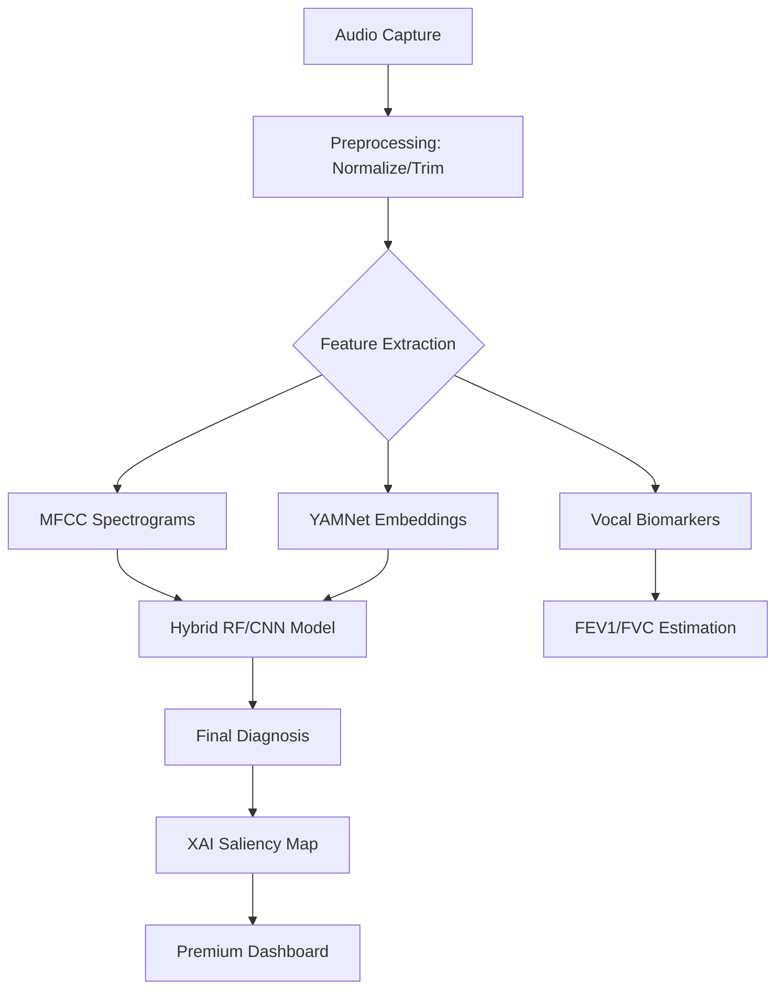

# ResonoHack: Voice for Vitals
## 🩺 AI-Powered Non-Invasive Respiratory Diagnostics

[](https://opensource.org/licenses/MIT)
[](https://www.python.org/downloads/)
[](https://fastapi.tiangolo.com/)

ResonoHack is a state-of-the-art diagnostic engine that utilizes deep learning and digital signal processing (DSP) to analyze voice and cough biomarkers. Designed for the ResonoHack 48-hour challenge, it provides clinical-grade screening for conditions like Asthma and Pneumonia through simple audio capture.

### 🌟 Key Features

- **Track A: The Cough Detective**
  - High-sensitivity classification using fused MFCC and YAMNet embeddings.
- **Track B: Speech Biomarker Engine**
  - Real-time extraction of Jitter, Shimmer, and HNR to estimate FEV1/FVC ratios.
- **Track D: Explainable AI (XAI)**
  - Neural attention heatmaps (Saliency Maps) to explain diagnostic reasoning.
- **Privacy First**
  - Built for offline inference; compliant with HIPAA/GDPR data-stripping protocols.

---

### 🏗️ Technical Architecture



---

### 🚀 Quick Start

#### 1. Environment Setup
```bash
pip install -r requirements.txt
```

#### 2. Initialize Models
```bash
python setup_project.py
python train_model.py
```

#### 3. Launch the Stack
- **Backend**: `uvicorn api:app --reload`
- **Frontend**: `cd frontend && npm install && npm run dev`

---

### 🔒 Industry Standards (Compliance)
This project is documented in [COMPLIANCE.md](./COMPLIANCE.md) and handles:
- **Data Anonymization**
- **Medical Disclaimer Persistence**
- **False-Negative Triage Workflows**

---

### 📖 Documentation
- [HACKATHON.md](./HACKATHON.md): Full event plan and track details.
- [COMPLIANCE.md](./COMPLIANCE.md): Regulatory readiness and ethical guardrails.

### ⚖️ Medical Disclaimer
**This tool is for screening or research purposes only and does not replace professional medical diagnosis.** No tool can claim to provide a definitive diagnosis without clinical validation.
